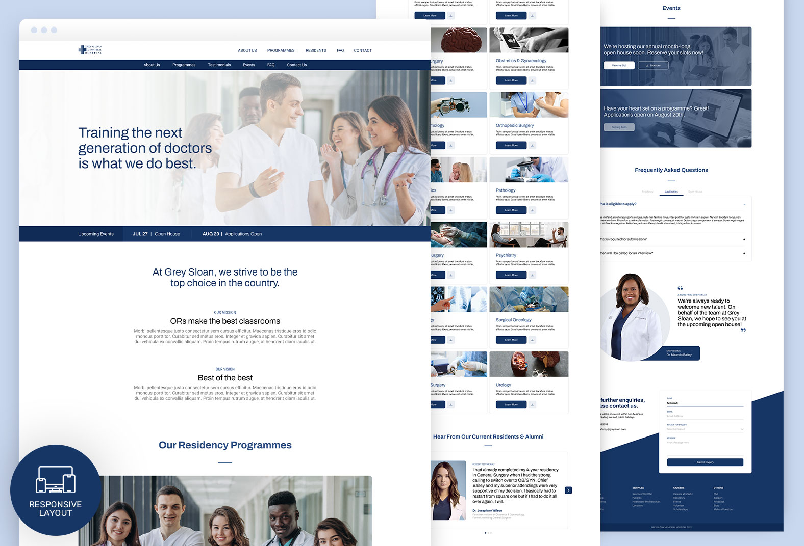

# gsmh

On my quest to polish up my web designing skills, this is the second in my list of prompts.

Having watched all 18 seasons of Grey's Anatomy (whew finally), I noticed how Grey Sloan Memorial Hospital was struggling to attract students at a recruitment drive.

Not going to give out any spoilers in case you've yet to watch the season finale but this is my take on how the hospital's residency programmes page would look like!

References are taken from NUHS's website, and I disliked how I had to click onto another page to view the programmes, FAQ, etc. so I thought of combining them all into one page.

[View landing page prototype](https://nsy-gsmh.netlify.app/)
